# 📦 Brz Ecommerce — Power BI Analytics

> **Análisis de +100,000 órdenes de un marketplace brasileño (2016–2018) con visualizaciones interactivas y dashboards dinámicos**  
> Herramientas: Power BI · Power Query · DAX · SQL Server

**Autor:** Joseph Velasco — Data Analyst

---

## 🏷️ Tecnologías


---

## 🔗 Acceso al Reporte

| Recurso | Enlace |
|---|---|
| 📊 **Reporte interactivo** | [Ver reporte en Power BI Service](https://app.powerbi.com/view?r=eyJrIjoiYWRkZDZmNWQtZmM1Ni00OTlhLTllMmMtMzMwMjBlYjRkMTg2IiwidCI6IjE4YzQ0ODRlLWFmYjctNGFjYS04NDM1LWZmYzQwOGY0YjE3NiJ9) |
| 📦 **Dataset original** | [Brazilian E-Commerce — Kaggle](https://www.kaggle.com/datasets/olistbr/brazilian-ecommerce) |

---

## 📊 Vista del Dashboard

### 💰 Vista General de Ventas — Ingresos, Ticket Promedio y KPIs Clave
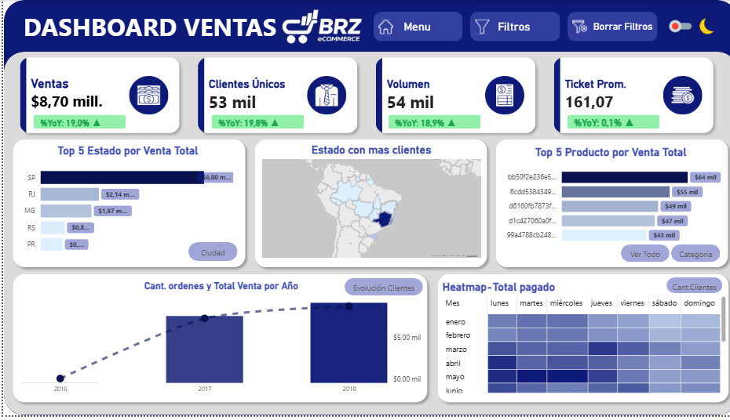

### 🗺️ Distribución Geográfica y Segmentación de Ventas por Región
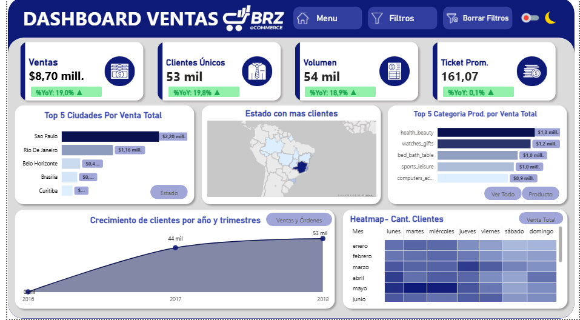

### 📊 Rendimiento Operativo — Satisfacción, Logística y Eficiencia de Vendedores
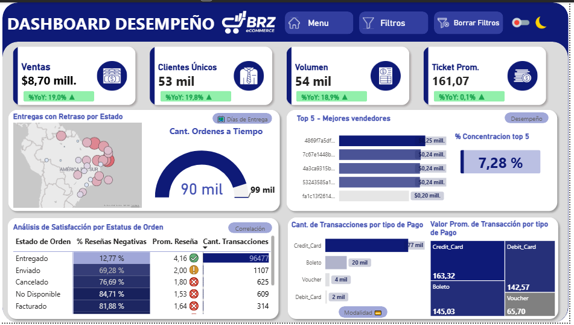

### 🏆 Ranking de Vendedores y Análisis de Concentración del Mercado
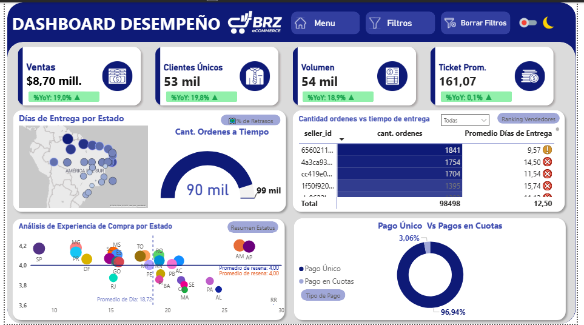

### 📈 Evolución Temporal de Ventas — Tendencias, Estacionalidad y Efecto Noviembre
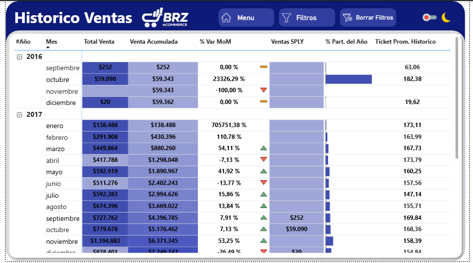

### 🛍️ Análisis de Rentabilidad por Categoría de Producto
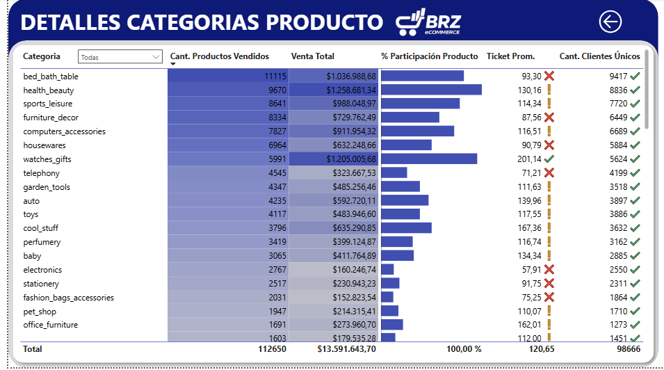

### 📦 Detalle de Productos — Volumen, Precio y Comportamiento de Venta
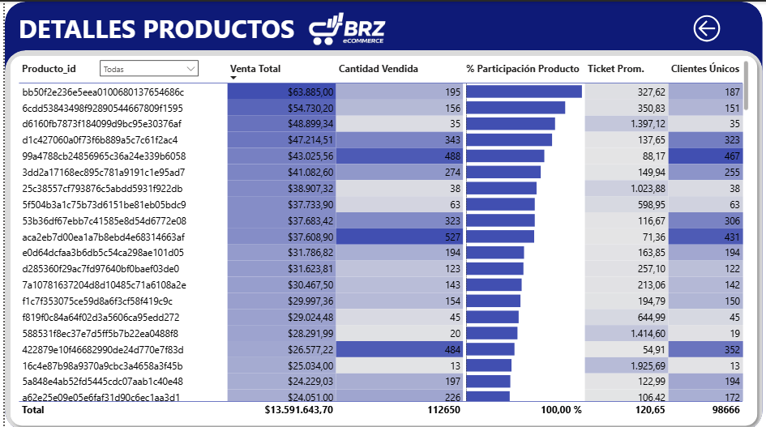

---

### 💰 Vista General de Ventas — Dark Mode
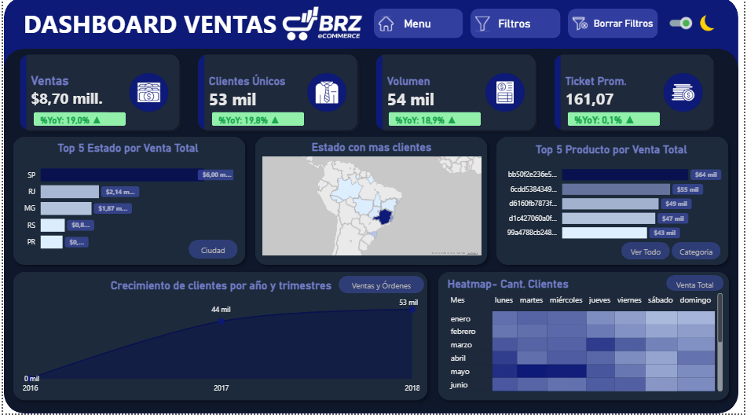

### 🗺️ Distribución Geográfica y Segmentación de Ventas — Dark Mode
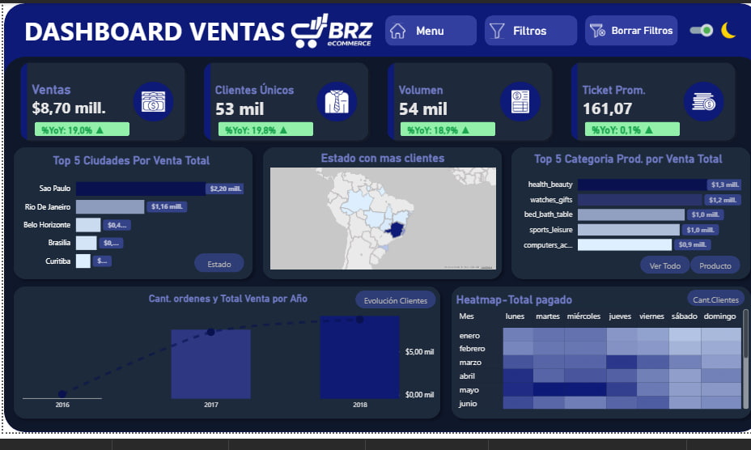

### 📊 Rendimiento Operativo — Dark Mode
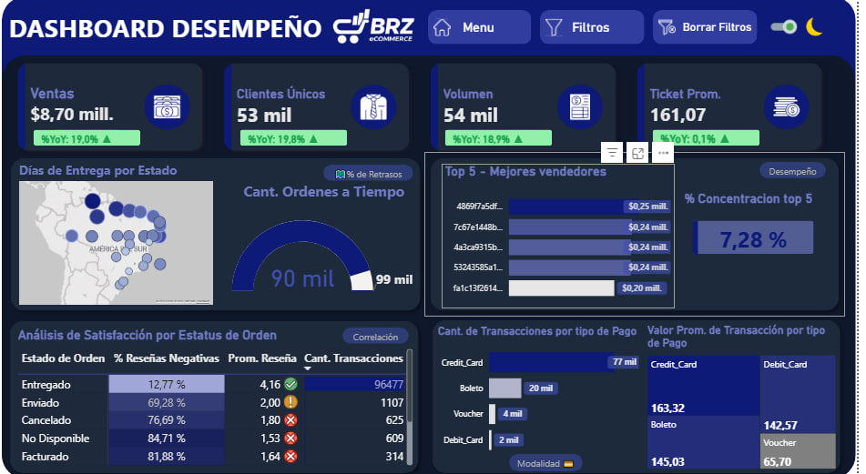

### 🏆 Ranking de Vendedores y Concentración del Mercado — Dark Mode
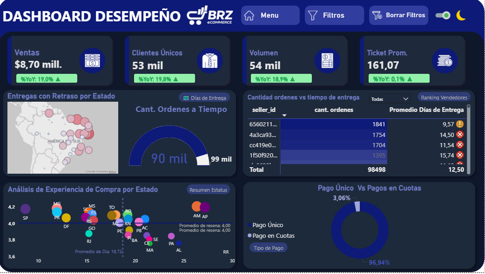

### 📈 Evolución Temporal de Ventas — Dark Mode
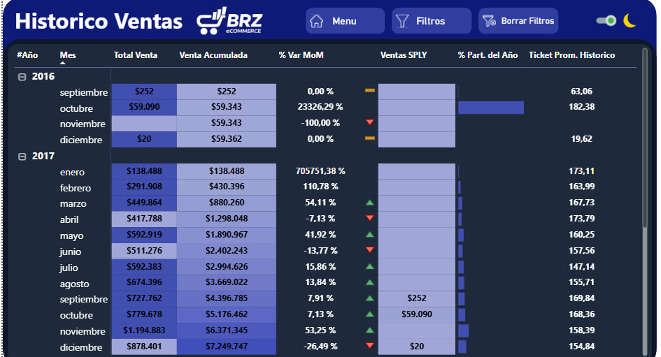

### 🛍️ Rentabilidad por Categoría de Producto — Dark Mode
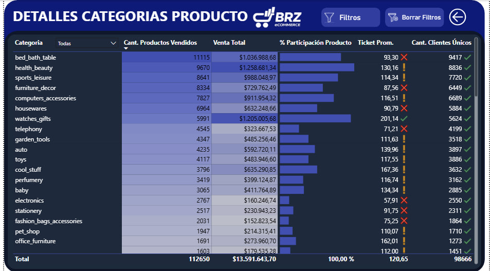

### 📦 Detalle de Productos — Dark Mode
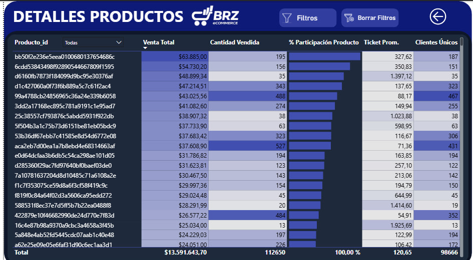
---

## 📌 Descripción del Proyecto

Este proyecto nace a partir de un trabajo previo realizado en **SQL Server**, donde se resolvieron las principales preguntas de negocio mediante consultas y vistas optimizadas. Ese análisis permitió validar la calidad de los datos, comprobar la lógica de negocio y asegurar que las métricas respondieran correctamente a los objetivos planteados.

Ahora el proyecto evoluciona hacia **Power BI**, aprovechando el modelo de datos ya diseñado y las consultas previamente resueltas en SQL. La intención no es repetir el trabajo, sino **potenciarlo con visualizaciones interactivas y dashboards dinámicos** que hacen más accesible la información para usuarios de negocio.

> 📁 El análisis técnico en SQL Server está documentado en el repositorio complementario:  
> **[Brz Ecommerce — SQL Server Analysis](./README_SQL.md)**

### ¿Qué hace especial a este proyecto?

La conexión directa entre **SQL Server y Power BI vía ODBC** garantiza que los datos lleguen limpios y optimizados, evitando transformaciones innecesarias. El modelo híbrido estrella — con `dim_ordenes_detalles` como hub central — permite navegar entre métricas de orden y métricas de ítem sin duplicar resultados, mientras que las relaciones inactivas con `USERELATIONSHIP` añaden flexibilidad para análisis temporales desde múltiples perspectivas de fecha.

---

## 📑 Índice

### 🧭 Instrucciones de navegación

- Los apartados siguen el flujo completo del proyecto: **Carga → Limpieza → Modelado → Análisis → Conclusiones**.
- Puedes volver al índice usando `Ctrl+F` y escribiendo **"📑 Índice"**.

---

- [1 — KPIs Principales](#1--kpis-principales)
- [2 — Arquitectura del Proyecto](#2--arquitectura-del-proyecto)
  - [2.1 — Carga de datos](#21--carga-de-datos)
  - [2.2 — Limpieza en Power Query](#22--limpieza-en-power-query)
  - [2.3 — Modelado en Power BI](#23--modelado-en-power-bi)
    - [Tablas del modelo](#tablas-del-modelo)
    - [Relaciones](#relaciones)
    - [Tabla Calendario](#tabla-calendario)
    - [Ajustes en reseñas y estados de orden](#ajustes-en-reseñas-y-estados-de-orden)
- [3 — Análisis de Negocio](#3--análisis-de-negocio)
  - [3.1 — Clientes y mercado](#31--clientes-y-mercado)
  - [3.2 — Ventas y productos](#32--ventas-y-productos)
  - [3.3 — Vendedores](#33--vendedores)
  - [3.4 — Logística y entregas](#34--logística-y-entregas)
  - [3.5 — Pagos y facturación](#35--pagos-y-facturación)
  - [3.6 — Satisfacción del cliente](#36--satisfacción-del-cliente)
- [4 — Próximos Pasos](#4--próximos-pasos)
- [5 — Conclusiones Finales](#5--conclusiones-finales)
- [6 — Estructura del Repositorio](#6--estructura-del-repositorio)
- [7 — Dataset](#7--dataset)
- [Contacto](#contacto)

---

## 1 — KPIs Principales

| Métrica | Valor |
|---|---|
| 💰 Ventas Totales | $8,700,000 |
| 👥 Clientes Únicos | 53,000 |
| 📦 Volumen de Órdenes | 54,000 |
| 🎫 Ticket Promedio | $161.07 |
| ✅ SLA de Entrega Cumplido | 90.8% (89,944 / 99,000 órdenes) |
| ⭐ Puntaje Promedio de Reseñas | 4.09 / 5.00 |
| 🏪 Concentración Top 10 Vendedores | 7.28% del mercado |

---

## 2 — Arquitectura del Proyecto

```
SQL Server (Brz_Ecommerce)
        │
        ▼ Conexión ODBC + SQL nativo
┌─────────────────────────┐
│   POWER QUERY (ETL)     │  ← Limpieza, normalización y tabla Calendario
│  dim_ordenes_detalles   │
│  dim_cliente            │
│  dim_vendedores         │
│  dim_productos          │
│  dim_ordenes_pago       │
│  fact_orders_items      │
│  Tabla_Calendario       │
└──────────┬──────────────┘
           │
           ▼
┌─────────────────────────┐
│  MODELO DE DATOS        │  ← Modelo híbrido estrella + medidas DAX
│  Motor VertiPaq         │  ← Motor analítico interno de Power BI
│  Hub: dim_ord_detalles  │
│  Relaciones activas     │
│  Relaciones inactivas   │
└──────────┬──────────────┘
           │
           ▼
┌─────────────────────────┐
│  DASHBOARDS             │  ← Visualizaciones interactivas
│  Dashboard Ventas       │
│  Dashboard Desempeño    │
│  Histórico de Ventas    │
│  Detalle Productos      │
│  Detalle Categorías     │
└─────────────────────────┘
```

---

### 2.1 — Carga de datos

- La carga se realizó mediante una **conexión ODBC** hacia SQL Server desde la base de datos **Brz_Ecommerce**.
- Los datos se tomaron directamente con **consultas SQL ya optimizadas** (las 6 vistas analíticas del proyecto SQL), lo que permitió:
  - Reducir la cantidad de pasos de procesamiento en Power BI.
  - Evitar transformaciones innecesarias en Power Query.
  - Garantizar que los datos lleguen limpios y listos para el modelado.
- Esta estrategia asegura un flujo más eficiente y mejor rendimiento del modelo.

---

### 2.2 — Limpieza en Power Query

- Se eliminaron columnas innecesarias para optimizar el rendimiento del modelo.
- Se normalizaron nombres de estados, ciudades y categorías de producto.
- Se revisaron y trataron valores nulos en `seller_id`, categorías de producto y reseñas.
- Se ajustaron tipos de datos:
  - **Fechas:** `order_purchase_timestamp`, `order_delivered_customer_date`
  - **Numéricos:** `payment_value`, `freight_value`
  - **Texto:** `estado`, `ciudad`, `categoria_producto`

---

### 2.3 — Modelado en Power BI

El modelo evolucionó de una estrella clásica a una **arquitectura híbrida** centrada en `dim_ordenes_detalles` como hub central. Esta tabla concentra clientes, vendedores, fechas, status y métricas de reseñas, evitando duplicaciones y simplificando el análisis.

#### Tablas del modelo

**🟦 Fact Table — `fact_orders_items`**  
Tabla de hechos con granularidad por ítem vendido en cada orden.
- `order_item_id`
- `order_id`
- `customer_id`
- `product_id`
- `seller_id`
- `price`
- `freight_value`
- `shipping_limit_date`

---

**🟩 Dimensión central — `dim_ordenes_detalles`**  
Hub central del modelo. Concentra información de órdenes, fechas, status y métricas de reseñas.
- `order_id`
- `customer_id`
- `seller_id`
- `order_status`
- `fecha_compra`
- `fecha_aprobacion`
- `fecha_entrega_cliente`
- `fecha_entrega_estimada`
- `fecha_envio_transportista`
- `fecha_limite_envio`
- `AvgReviewScore`
- `CountReviews`
- `MaxReviewScore`
- `MinReviewScore`

---

**🟩 Dimensión — `dim_cliente`**  
Información geográfica y demográfica del cliente.
- `customer_id`
- `customer_unique_id`
- `customer_city`
- `customer_state`
- `customer_zip_code_prefix`
- `geolocation_lat`
- `geolocation_lng`

---

**🟩 Dimensión — `dim_vendedores`**  
Información del vendedor.
- `seller_id`
- `seller_city`
- `seller_state`
- `seller_zip_code`

---

**🟩 Dimensión — `dim_productos`**  
Catálogo de productos.
- `product_id`
- `product_category`

---

**🟩 Pagos — `dim_ordenes_pago`**  
Detalle de pagos por orden.
- `order_id`
- `payment_sequential`
- `payment_type`
- `payment_value`

---

**📅 Tabla — `Tabla_Calendario`**  
Tabla de fechas para análisis temporal e inteligencia de tiempo.
- `fecha` / `fechask`
- `año` / `mes` / `mescorto`
- `añomes` / `añomescorto`
- `trimestre` / `añotrimestre`
- `semanaAño` / `SemanaMes`
- `cierresemana` / `iniciomes` / `finmes`
- `dia` / `diacorto` / `diaaño` / `diasemana`

---

#### Relaciones

**Relaciones activas (todas 1:N):**

- **dim_cliente (1)** → **dim_ordenes_detalles (N)**
- **dim_vendedores (1)** → **dim_ordenes_detalles (N)**
- **dim_productos (1)** → **fact_orders_items (N)**
- **dim_ordenes_detalles (1)** → **fact_orders_items (N)**
- **dim_ordenes_pago (N)** → **dim_ordenes_detalles (1)**
- **Tabla_Calendario (1)** → **dim_ordenes_detalles (N)** — vía `fecha_compra`

**Relaciones inactivas** *(se activan con `USERELATIONSHIP` en medidas específicas)*:
- **dim_cliente (1)** → **fact_orders_items (N)**
- **dim_vendedores (1)** → **fact_orders_items (N)**
- **Tabla_Calendario (1)** → **dim_ordenes_detalles (N)** — vía `order_delivered_customer_date`
- **Tabla_Calendario (1)** → **dim_ordenes_detalles (N)** — vía `order_approved_at`

---

#### Tabla Calendario

Para habilitar funciones de inteligencia de tiempo (YTD, YoY, MTD), se creó la `Tabla_Calendario` en Power Query basada en la columna `fecha_compra`.

- **Relación activa:** `Tabla_Calendario[Fecha]` → `dim_ordenes_detalles[fecha_compra]`
- Las relaciones inactivas hacia `order_delivered_customer_date` y `order_approved_at` permiten análisis desde la perspectiva de entrega o aprobación usando `USERELATIONSHIP`.
- Incluye jerarquías completas: Año, Trimestre, Mes, Semana, Día y columnas auxiliares de inicio/fin de mes.

---

#### Ajustes en reseñas y estados de orden

Durante el modelado se realizaron cambios importantes para simplificar el modelo y mejorar la legibilidad:

**Centralización de reseñas en `dim_ordenes_detalles`:**
- Se deshabilitó la carga directa de la tabla `db_ordenes_reviews`.
- Se agruparon las reseñas por `order_id` y se calcularon métricas agregadas:
  - `AvgReviewScore` → Promedio de reseñas por orden.
  - `CountReviews` → Cantidad de reseñas por orden.
  - `MinReviewScore` / `MaxReviewScore` → Reseña mínima y máxima por orden.
- Estas columnas se integraron en `dim_ordenes_detalles`, evitando relaciones adicionales y reduciendo la cardinalidad del modelo.

**Manejo de valores nulos:**
- Se mantuvieron los valores `null` en métricas de reseñas para no distorsionar promedios y sumas.
- Los `null` permiten identificar órdenes canceladas o sin reseña en combinación con `order_status`.

**Traducción de estados de orden (`order_status`):**

| Valor original | Traducción |
|---|---|
| `approved` | Aprobado |
| `canceled` | Cancelado |
| `created` | Creado |
| `delivered` | Entregado |
| `invoiced` | Facturado |
| `processing` | En Proceso |
| `shipped` | Enviado |
| `unavailable` | No Disponible |

---

## 3 — Análisis de Negocio

### 3.1 — Clientes y mercado

*Análisis del alcance geográfico y la expansión de la base de usuarios.*

**3.1.1 — Concentración por estado:**

| Estado | Clientes Únicos |
|---|---|
| SP | 40,300 |
| RJ | 12,380 |
| RS | 5,280 |

> **Insight:** El mercado está fuertemente liderado por la región sureste de Brasil. SP concentra el ~41% del total de clientes. Oportunidad de expansión en el norte y noreste, regiones con baja penetración y alta población potencial.

**3.1.2 — Crecimiento de nuevos clientes:**

- 🚀 **Periodo 2016–2017:** Crecimiento explosivo del **13,308.9%** — fase de escalado del marketplace.
- 📈 **Periodo 2017–2018:** Crecimiento sostenido del **20.7%** — señal de consolidación en el mercado.

**3.1.3 — Ciudades con mayor volumen de venta:**

| Ciudad | Volumen de Venta |
|---|---|
| São Paulo | $2,200,000 |
| Rio de Janeiro | $1,160,000 |
| Belo Horizonte | $421,770 |
| Brasília | $354,422 |
| Curitiba | $247,390 |

---

### 3.2 — Ventas y productos

*Identificación de los motores de ingresos y preferencias del consumidor.*

**3.2.1 — Categorías con mayor rotación (Top 5):**

| Categoría | Unidades Vendidas |
|---|---|
| bed_bath_table | 11,115 |
| health_beauty | 9,670 |
| sports_leisure | 8,641 |
| furniture_decor | 8,334 |
| computers_accessories | 7,827 |

**3.2.2 — Ticket promedio por cliente:** $161.07

**3.2.3 — Productos de mayor valor de venta:**

| SKU del Producto | Venta Total |
|---|---|
| `bb50f2e236e5eea0100680137654686c` | $63,885.00 |
| `6cdd53843498f92890544667809f1595` | $54,730.20 |
| `d6160fb7873f184099d9bc95e30376af` | $48,899.34 |

**3.2.4 — Estacionalidad y comportamiento temporal:**

- **Picos de venta anual:** marzo a junio concentra el mayor volumen de transacciones.
- **Dinámica semanal:** los días de mayor actividad comercial son de lunes a jueves.
- **El "Efecto Noviembre":** los viernes de noviembre se convierten en los días de mayor venta y mayor captación de nuevos clientes, atribuido al impacto del **Black Friday**.

> **Implicación operativa:** el Black Friday exige planificación logística diferenciada. Se recomienda pre-posicionar inventario y ampliar capacidad las 2 semanas previas al último viernes de noviembre.

---

### 3.3 — Vendedores

*Evaluación del ecosistema de socios y eficiencia operativa.*

**3.3.1 — Ranking de órdenes por vendedor:**

El vendedor líder (`id:6560211a19b47992c3666cc44a7e94c0`) gestiona **1,841 órdenes**, seguido por el segundo lugar (`id:4a3ca9315b744ce9f8e9374361493884`) con 1,754.

**3.3.2 — Nivel de concentración del mercado:**

El Top 10 de vendedores concentra solo el **7.28%** del mercado.

> **Insight:** Al ser menor al 10%, el marketplace demuestra una competitividad sana y baja dependencia de vendedores individuales. Esto reduce el riesgo operativo y beneficia al consumidor final.

**3.3.3 — Desempeño en tiempos de entrega:**

- **Mejor vendedor:** `d13e50eaa47b4cbe9eb81465865d8cfc` con **5 días** promedio de entrega.
- **Promedio eficiente:** los mejores vendedores promedian **6.49 días**, frente a la media general de **12.5 días**.

---

### 3.4 — Logística y entregas

*Análisis de cumplimiento de tiempos y distribución geográfica.*

**3.4.1 — Tiempo promedio de entrega por estado:**

- **Mínimo:** 8.70 días — Estado **SP**
- **Máximo:** 29.34 días — Estado **RR**

**3.4.2 — Órdenes dentro del tiempo estimado (SLA):**

De 99,000 órdenes totales, **89,944 (90.8%)** se entregaron a tiempo.

**3.4.3 — Estados con mayor índice de retraso:**

| Estado | % de Retraso |
|---|---|
| AL | 21.41% |
| MA | 17.43% |
| SE | 15.22% |

> **Foco de atención:** los estados del noreste presentan tasas de retraso muy por encima del promedio nacional (9.2%). Se recomienda evaluar alianzas con operadores logísticos regionales o establecer centros de distribución intermedios en esa zona.

---

### 3.5 — Pagos y facturación

*Análisis de preferencias financieras y modalidades de pago.*

**3.5.1 — Métodos de pago más utilizados:**

El sistema de pagos está dominado por medios electrónicos.
- **Tarjeta de Crédito:** método preferido por la gran mayoría de los usuarios.
- **Boleto Bancario:** segunda opción más relevante.

**3.5.2 — Valor promedio de transacción por tipo de pago:**

| Método de Pago | Ticket Promedio |
|---|---|
| Credit Card | $163.32 |
| Debit Card | $142.57 |
| Boleto | $142.57 |
| Voucher | $65.70 |

> **Insight:** los clientes que usan tarjeta de crédito realizan compras de mayor valor que los demás métodos, lo que abre una oportunidad de personalización de ofertas por método de pago.

**3.5.3 — Modalidad: Pago único vs. cuotas:**

| Modalidad | % de Órdenes |
|---|---|
| Pago Único | 96.94% |
| Pago en Cuotas | 3.06% |

---

### 3.6 — Satisfacción del cliente

*Correlación entre la operatividad logística y la percepción del usuario.*

**3.6.1 — Reseñas negativas por estatus de orden:**

Se identificó un volumen crítico de reseñas negativas en órdenes con estatus **"En Proceso"**.

> **Insight clave:** el problema real de insatisfacción ocurre durante el procesamiento interno de la orden, incluso **antes** de que el paquete sea entregado al transportista. Esto indica una falla operativa interna, no logística externa.

**3.6.2 — Relación: tiempo de entrega vs. satisfacción:**

| Estado | Días Promedio Entrega | Puntaje Promedio |
|---|---|---|
| AM | 26.36 días | 4.21 ⭐ |
| RR | 29.34 días | 3.61 ⭐ |

> **Conclusión:** el tiempo de entrega influye, pero **la calidad de la atención durante la espera puede mitigar el impacto de una entrega tardía**. AM entrega tarde pero bien atendido; RR entrega tarde y mal gestionado.

**3.6.3 — Desempeño general de satisfacción:**

El puntaje promedio en transacciones entregadas es **4.09 / 5.00**, con el 57% de las reseñas en puntaje máximo (5 estrellas). Hay oportunidades claras de mejora en los centros logísticos del Norte y Noreste.

---

## 4 — Próximos Pasos

*Roadmap estratégico para escalar el proyecto.*

- **🛡️ Implementación de RLS (Row Level Security):** configurar seguridad a nivel de fila para que cada vendedor acceda únicamente a sus propias métricas en un entorno multi-usuario.
- **⚡ Automatización de alertas:** crear flujos en Power Automate que notifiquen al equipo de logística cuando el SLA en estados críticos (AL, MA) baje del 85%.
- **📈 Expansión del modelo:** incorporar datos de costos de adquisición de clientes (CAC) y marketing para calcular el ROI real por categoría de producto.
- **📊 Página de Executive Summary:** una sola pantalla con los 5 hallazgos más importantes en lenguaje de negocio, sin gráficos complejos, orientada a audiencia gerencial.
- **🔧 Reclasificación de `dim_ordenes_pago`:** mover a fact table para mejorar la integridad del modelo dimensional.

---

## 5 — Conclusiones Finales

El proyecto **Brz Ecommerce** demuestra una integración exitosa entre la ingeniería de datos en SQL Server y la visualización estratégica en Power BI. A través del procesamiento de más de **100,000 registros**, se logró:

1. **Identificar patrones de estacionalidad:** el comportamiento de compra cambia drásticamente en noviembre, exigiendo una logística diferenciada para los viernes de ese mes.
2. **Detectar ineficiencias internas:** la insatisfacción del cliente en el Norte/Noreste no es solo por transporte — el estado "En Proceso" es la mayor fuente de reseñas negativas.
3. **Validar la salud del marketplace:** la baja concentración del Top 10 de vendedores (7.28%) confirma un ecosistema competitivo y estable, con bajo riesgo de dependencia.

---

## 🛠️ Stack Tecnológico

| Herramienta | Aplicación en el Proyecto |
|---|---|
| **SQL Server** | ETL, limpieza, vistas analíticas y validación de lógica de negocio |
| **Power BI** | Modelado dimensional híbrido, DAX avanzado y diseño de UI/UX |
| **Power Query (M)** | Limpieza, normalización, tabla Calendario y centralización de reseñas |
| **DAX** | KPIs, YoY, YTD, concentración de mercado, USERELATIONSHIP |
| **Markdown** | Documentación técnica y comunicación de hallazgos |

---

## 6 — Estructura del Repositorio

```
📁 Proyecto2-BrzEcommerce/
│
├── 📝 README_SQL.md                      ← Este archivo (SQL Server)
├── 📝 README_BRZ_PowerBI.md              ← Documentación Power BI
├── 📋 BRZ_Ecommerce_Documentacion.docx   ← Documentación ejecutiva completa
├── 📊 Brz_Ecommerce.pbix                 ← Archivo Power BI (25.3 MB)
│
├── 🗄️ 01_Brz_Ecommerce_Database_Setup.sql
├── 🗄️ 02_Brz_Ecommerce_Data_Model_Views.sql
├── 🗄️ 03_Brz_Ecommerce_Business_Analysis.sql
│
└── 📁 screenshots/
    ├── Ventas.png
    ├── Ventas_2.png
    ├── Ventas_Dark_mode.png
    ├── Ventas_2_Dark_Mode.png
    ├── Desempeno.png
    ├── Desempeno_2.png
    ├── Desempeno_Dark_Mode.png
    ├── Desempeno_2_Dark_Mode.png
    ├── Historico_de_ventas.png
    ├── Historico_de_ventas_Dark_Mode.png
    ├── Tabla_Categoria_Productos.png
    ├── Tabla_Categorias_Productos_Dark_Mode.png
    ├── Tabla_de_Productos.png
    └── Tabla_Productos_Dark_Mode.png
```

---

## 7 — Dataset

- **Fuente:** [Brazilian E-Commerce Public Dataset by Olist — Kaggle](https://www.kaggle.com/datasets/olistbr/brazilian-ecommerce)
- **Período:** Septiembre 2016 – Octubre 2018
- **Registros:** 99,441 órdenes / 112,650 ítems
- **Tablas originales:** orders, customers, order_items, order_payments, order_reviews, products, sellers, geolocation, product_category_name_translation.

---

## 📬 Contacto

**Joseph Velasco** — *Data Analyst | SQL Server · Power BI · Business Intelligence*

- 🔗 **LinkedIn:** [linkedin.com/in/joseph-velasco](https://linkedin.com/in/joseph-velasco)
- 💼 **Portfolio:** [Tu enlace aquí]
- 🐙 **GitHub:** [github.com/joseph-velasco](https://github.com/joseph-velasco)

---
